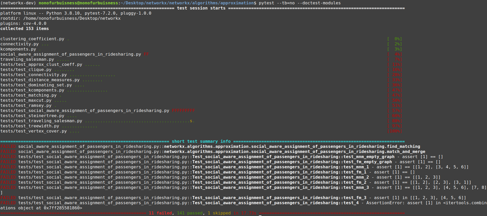

הצילום מסך הוא של הבדיקות בלי הdoctest (רק pytest) כי הצילום מסך שכולל את הכל לא מתאפשר בגלל גודל המסך.

להלן מה שהתקבל בהרצה:
 ```
(networkx-dev) nonofurbuisness@nonofurbuisness:~/Desktop/networkx/networkx/algorithms/approximation$ pytest --doctest-modules
==================================================================== test session starts =====================================================================
platform linux -- Python 3.8.10, pytest-7.2.0, pluggy-1.0.0
rootdir: /home/nonofurbuisness/Desktop/networkx
plugins: cov-4.0.0
collected 153 items                                                                                                                                          

clustering_coefficient.py .                                                                                                                            [  0%]
connectivity.py ...                                                                                                                                    [  2%]
kcomponents.py .                                                                                                                                       [  3%]
social_aware_assignment_of_passengers_in_ridesharing.py FF                                                                                             [  4%]
traveling_salesman.py .....                                                                                                                            [  7%]
tests/test_approx_clust_coeff.py ......                                                                                                                [ 11%]
tests/test_clique.py ........                                                                                                                          [ 16%]
tests/test_connectivity.py ..................                                                                                                          [ 28%]
tests/test_distance_measures.py ........                                                                                                               [ 33%]
tests/test_dominating_set.py ....                                                                                                                      [ 36%]
tests/test_kcomponents.py ................                                                                                                             [ 47%]
tests/test_matching.py .                                                                                                                               [ 47%]
tests/test_maxcut.py .....                                                                                                                             [ 50%]
tests/test_ramsey.py .                                                                                                                                 [ 51%]
tests/test_social_aware_assignment_of_passengers_in_ridesharing.py FFFFFFFFF                                                                           [ 57%]
tests/test_steinertree.py ....                                                                                                                         [ 60%]
tests/test_traveling_salesman.py .........................................s.                                                                           [ 88%]
tests/test_treewidth.py ..............                                                                                                                 [ 97%]
tests/test_vertex_cover.py ....                                                                                                                        [100%]

========================================================================== FAILURES ==========================================================================
_______________________ [doctest] networkx.algorithms.approximation.social_aware_assignment_of_passengers_in_ridesharing.find_matching _______________________
058     :param Opt: Optimal partition
059     :return: A matching R_l in G_l
060 
061     Example
062     >>> G = nx.Graph()
063     >>> list_of_edges = [(1, 2), (1, 3), (1, 5), (1, 6), (2, 4), (2, 7), (3, 4), (3, 5), (3, 6), (4, 5), (4, 6), (4, 7), (5, 8), (6, 7), (6, 8)]
064     >>> G.add_edges_from(list_of_edges)
065     >>> l = 3
066     >>> Opt = [[1, 2, 3], [4, 5, 6], [7, 8]]
067     >>> find_matching(G, l, P)
UNEXPECTED EXCEPTION: NameError("name 'P' is not defined")
Traceback (most recent call last):
  File "/usr/lib/python3.8/doctest.py", line 1336, in __run
    exec(compile(example.source, filename, "single",
  File "<doctest networkx.algorithms.approximation.social_aware_assignment_of_passengers_in_ridesharing.find_matching[5]>", line 1, in <module>
NameError: name 'P' is not defined
/home/nonofurbuisness/Desktop/networkx/networkx/algorithms/approximation/social_aware_assignment_of_passengers_in_ridesharing.py:67: UnexpectedException
______________________ [doctest] networkx.algorithms.approximation.social_aware_assignment_of_passengers_in_ridesharing.match_and_merge ______________________
028     :param G: Graph
029     :param k: Number of passengers
030     :return: A partition P of G of all matched sets
031     
032     Example where G={(v1,v2),(v2,v3),(v3,v4),(v4,v5),(v4,v6)} and k=4:
033     >>> G = nx.Graph()
034     >>> list_of_edges = [(1, 2), (2, 3), (3, 4), (4, 5), (4, 6)]
035     >>> G.add_edges_from(list_of_edges)
036     >>> k = 4
037     >>> match_and_merge(G, k)
Expected:
    [[1, 2], [3, 4, 5, 6]]
Got:
    [1]

/home/nonofurbuisness/Desktop/networkx/networkx/algorithms/approximation/social_aware_assignment_of_passengers_in_ridesharing.py:37: DocTestFailure
_______________________________________ Test_social_aware_assignment_of_passengers_in_ridesharing.test_mnm_empty_graph _______________________________________

self = <networkx.algorithms.approximation.tests.test_social_aware_assignment_of_passengers_in_ridesharing.Test_social_aware_assignment_of_passengers_in_ridesharing object at 0x7fa885e75910>

    def test_mnm_empty_graph(self):
        G = nx.Graph()
        k = 5
>       assert match_and_merge(G, k) == []
E       assert [1] == []
E         Left contains one more item: 1
E         Use -v to get more diff

tests/test_social_aware_assignment_of_passengers_in_ridesharing.py:40: AssertionError
_______________________________________ Test_social_aware_assignment_of_passengers_in_ridesharing.test_fm_empty_graph ________________________________________

self = <networkx.algorithms.approximation.tests.test_social_aware_assignment_of_passengers_in_ridesharing.Test_social_aware_assignment_of_passengers_in_ridesharing object at 0x7fa885e898b0>

    def test_fm_empty_graph(self):
        G = nx.Graph()
        l = 5
        Opt = []
>       assert find_matching(G, l, Opt) == []
E       assert [1] == []
E         Left contains one more item: 1
E         Use -v to get more diff

tests/test_social_aware_assignment_of_passengers_in_ridesharing.py:46: AssertionError
____________________________________________ Test_social_aware_assignment_of_passengers_in_ridesharing.test_mnm_1 ____________________________________________

self = <networkx.algorithms.approximation.tests.test_social_aware_assignment_of_passengers_in_ridesharing.Test_social_aware_assignment_of_passengers_in_ridesharing object at 0x7fa885e89be0>

    def test_mnm_1(self):
        G, k = case_1()
>       assert match_and_merge(G, k) == [[1, 2], [3, 4, 5, 6]]
E       assert [1] == [[1, 2], [3, 4, 5, 6]]
E         At index 0 diff: 1 != [1, 2]
E         Right contains one more item: [3, 4, 5, 6]
E         Use -v to get more diff

tests/test_social_aware_assignment_of_passengers_in_ridesharing.py:50: AssertionError
____________________________________________ Test_social_aware_assignment_of_passengers_in_ridesharing.test_fm_1 _____________________________________________

self = <networkx.algorithms.approximation.tests.test_social_aware_assignment_of_passengers_in_ridesharing.Test_social_aware_assignment_of_passengers_in_ridesharing object at 0x7fa885e89dc0>

    def test_fm_1(self):
        G, k = case_1()
        P = match_and_merge(G, k)
>       assert find_matching(G, k-1, P) == []
E       assert [1] == []
E         Left contains one more item: 1
E         Use -v to get more diff

tests/test_social_aware_assignment_of_passengers_in_ridesharing.py:55: AssertionError
____________________________________________ Test_social_aware_assignment_of_passengers_in_ridesharing.test_mnm_2 ____________________________________________

self = <networkx.algorithms.approximation.tests.test_social_aware_assignment_of_passengers_in_ridesharing.Test_social_aware_assignment_of_passengers_in_ridesharing object at 0x7fa885e89fa0>

    def test_mnm_2(self):
        G, k = case_2()
>       assert match_and_merge(G, k) == [[1, 2, 3]]
E       assert [1] == [[1, 2, 3]]
E         At index 0 diff: 1 != [1, 2, 3]
E         Use -v to get more diff

tests/test_social_aware_assignment_of_passengers_in_ridesharing.py:59: AssertionError
____________________________________________ Test_social_aware_assignment_of_passengers_in_ridesharing.test_fm_2 _____________________________________________

self = <networkx.algorithms.approximation.tests.test_social_aware_assignment_of_passengers_in_ridesharing.Test_social_aware_assignment_of_passengers_in_ridesharing object at 0x7fa87774c1c0>

    def test_fm_2(self):
        G, k = case_2()
        P = match_and_merge(G, k)
>       assert find_matching(G, k-1, P) == [[1, 2], [2, 3], [3, 1]]
E       assert [1] == [[1, 2], [2, 3], [3, 1]]
E         At index 0 diff: 1 != [1, 2]
E         Right contains 2 more items, first extra item: [2, 3]
E         Use -v to get more diff

tests/test_social_aware_assignment_of_passengers_in_ridesharing.py:64: AssertionError
____________________________________________ Test_social_aware_assignment_of_passengers_in_ridesharing.test_mnm_3 ____________________________________________

self = <networkx.algorithms.approximation.tests.test_social_aware_assignment_of_passengers_in_ridesharing.Test_social_aware_assignment_of_passengers_in_ridesharing object at 0x7fa87774c3a0>

    def test_mnm_3(self):
        G, k = case_3()
>       assert match_and_merge(G, k) == [[1, 2, 3], [4, 5, 6], [7, 8]]
E       assert [1] == [[1, 2, 3], [4, 5, 6], [7, 8]]
E         At index 0 diff: 1 != [1, 2, 3]
E         Right contains 2 more items, first extra item: [4, 5, 6]
E         Use -v to get more diff

tests/test_social_aware_assignment_of_passengers_in_ridesharing.py:68: AssertionError
____________________________________________ Test_social_aware_assignment_of_passengers_in_ridesharing.test_fm_3 _____________________________________________

self = <networkx.algorithms.approximation.tests.test_social_aware_assignment_of_passengers_in_ridesharing.Test_social_aware_assignment_of_passengers_in_ridesharing object at 0x7fa87774c580>

    def test_fm_3(self):
        G, k = case_3()
        P = match_and_merge(G, k)
>       assert find_matching(G, k, P) in [[1, 2, 3], [4, 5, 6]]
E       assert [1] in [[1, 2, 3], [4, 5, 6]]
E        +  where [1] = find_matching(<networkx.classes.graph.Graph object at 0x7fa86b943970>, 3, [1])

tests/test_social_aware_assignment_of_passengers_in_ridesharing.py:73: AssertionError
______________________________________________ Test_social_aware_assignment_of_passengers_in_ridesharing.test_4 ______________________________________________

self = <networkx.algorithms.approximation.tests.test_social_aware_assignment_of_passengers_in_ridesharing.Test_social_aware_assignment_of_passengers_in_ridesharing object at 0x7fa87774c760>

    def test_4(self):
        # For each n between 5 and 15 (inclusive), generate a clique graph with n nodes and check for 5<k≤15
        for n in range(5, 15):
            G = nx.complete_graph(n)
            for k in range(5, 15):
                if k<=n:
                    P = match_and_merge(G, k)
                    assert len(P) == math.ceil(math.log(n, k))
>                   assert find_matching(G, k-1, P) in itertools.combinations(G.nodes(), k-1)
E                   AssertionError: assert [1] in <itertools.combinations object at 0x7fa86b934810>
E                    +  where [1] = find_matching(<networkx.classes.graph.Graph object at 0x7fa86b8df0a0>, (5 - 1), [1])
E                    +  and   <itertools.combinations object at 0x7fa86b934810> = <class 'itertools.combinations'>(NodeView((0, 1, 2, 3, 4)), (5 - 1))
E                    +    where <class 'itertools.combinations'> = itertools.combinations
E                    +    and   NodeView((0, 1, 2, 3, 4)) = NodeView((0, 1, 2, 3, 4))()
E                    +      where NodeView((0, 1, 2, 3, 4)) = <networkx.classes.graph.Graph object at 0x7fa86b8df0a0>.nodes

tests/test_social_aware_assignment_of_passengers_in_ridesharing.py:83: AssertionError
================================================================== short test summary info ===================================================================
FAILED social_aware_assignment_of_passengers_in_ridesharing.py::networkx.algorithms.approximation.social_aware_assignment_of_passengers_in_ridesharing.find_matching
FAILED social_aware_assignment_of_passengers_in_ridesharing.py::networkx.algorithms.approximation.social_aware_assignment_of_passengers_in_ridesharing.match_and_merge
FAILED tests/test_social_aware_assignment_of_passengers_in_ridesharing.py::Test_social_aware_assignment_of_passengers_in_ridesharing::test_mnm_empty_graph - assert [1] == []
FAILED tests/test_social_aware_assignment_of_passengers_in_ridesharing.py::Test_social_aware_assignment_of_passengers_in_ridesharing::test_fm_empty_graph - assert [1] == []
FAILED tests/test_social_aware_assignment_of_passengers_in_ridesharing.py::Test_social_aware_assignment_of_passengers_in_ridesharing::test_mnm_1 - assert [1] == [[1, 2], [3, 4, 5, 6]]
FAILED tests/test_social_aware_assignment_of_passengers_in_ridesharing.py::Test_social_aware_assignment_of_passengers_in_ridesharing::test_fm_1 - assert [1] == []
FAILED tests/test_social_aware_assignment_of_passengers_in_ridesharing.py::Test_social_aware_assignment_of_passengers_in_ridesharing::test_mnm_2 - assert [1] == [[1, 2, 3]]
FAILED tests/test_social_aware_assignment_of_passengers_in_ridesharing.py::Test_social_aware_assignment_of_passengers_in_ridesharing::test_fm_2 - assert [1] == [[1, 2], [2, 3], [3, 1]]
FAILED tests/test_social_aware_assignment_of_passengers_in_ridesharing.py::Test_social_aware_assignment_of_passengers_in_ridesharing::test_mnm_3 - assert [1] == [[1, 2, 3], [4, 5, 6], [7, 8]]
FAILED tests/test_social_aware_assignment_of_passengers_in_ridesharing.py::Test_social_aware_assignment_of_passengers_in_ridesharing::test_fm_3 - assert [1] in [[1, 2, 3], [4, 5, 6]]
FAILED tests/test_social_aware_assignment_of_passengers_in_ridesharing.py::Test_social_aware_assignment_of_passengers_in_ridesharing::test_4 - AssertionError: assert [1] in <itertools.combinations object at 0x7fa86b934810>
========================================================= 11 failed, 141 passed, 1 skipped in 18.92s =========================================================

```
